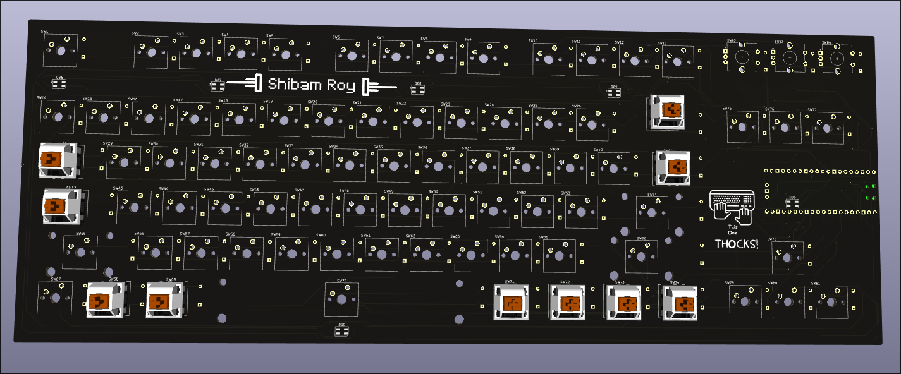
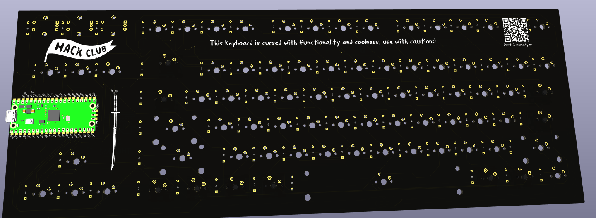
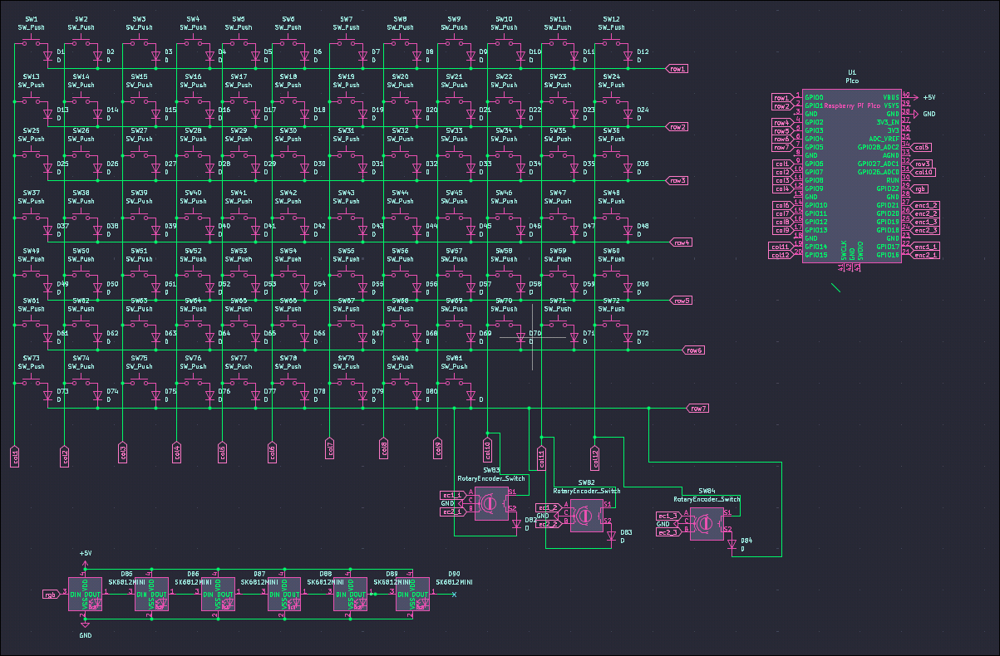
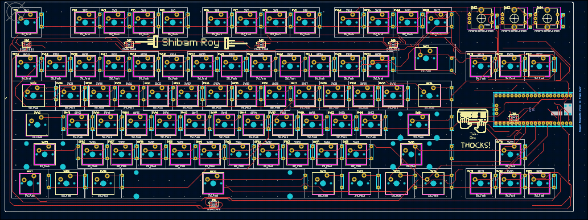
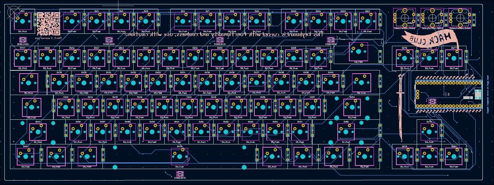

# RoyBoard 

A Custom wired mechanical keyboard that I made by myself! This is a part of [hackclub's](https://hackclub.com/) [hackpad](https://hackpad.hackclub.com/) event, where teenagers like me make their own macropads and keyboards.

## Features 😎

- Includes RGB lights (not per key RGB)
- Has 1 rotary encoder, but has multiple functions
- Consists of 81 keys in total, a 75% keyboard
- Controllable RGB light brightness

## What components does it use?

## Screenshots

## What tools did I use?

- [kiCad](https://www.kicad.org/) : For PCB designing
- [shapr3d](https://www.shapr3d.com/) : For Case designing

## Firmware

As of now, the firmware is untested, and is written with [kmk](https://github.com/KMKfw/kmk_firmware/blob/main/docs/en/Getting_Started.md).
Does exactly what you would expect a keyboard to do, along with some handy functions(Not yet tested, but I am pretty sure they are gonna be helpful)

## Usage

The RGB lights act kind of like indicators, which indicate 1 of 3 modes.
The first mode is Volume, when all the lights are blue in color. In this mode, the rotary encoder is set to control the volume.

The second mode is Brightness, when all the lights are red in color. In this mode, the rotary encoder 

The third mode is what I call the *Rizz Mode*, in this mode, the RGB lights go crazy and do a rgb color cycle. In this the rotary encoder controls the color brightness.

Except for that the key mapping goes as follows:

| Keys | Action |
| :--- | :--- |
| <kbd>1st</kbd> | Opens Browser |
| <kbd>2nd</kbd> | Opens Youtube |
| <kbd>3rd</kbd> | Opens Slack |
| <kbd>4th</kbd> | Starts Terminal |
| <kbd>5th</kbd> | Kills current  window (qtile) |
| <kbd>6th</kbd> | Full screen toggle (qtile)|
| <kbd>7th</kbd> | macropad mode toggle |
| <kbd>8th</kbd> | Most used sentence |
| <kbd>9th</kbd> | Mouse mode toggle (upcoming feature)|

## Bill of materials

Check BOM.md for that please!

## To-Do 🛠️
- Do testing
- Add the mouse mode toggle feature

## Known bugs 🐞
- not yet tested, so no idea:/ , lmk if you find any!

## Contributing 🤝

Everyone is welcome to contribute to the code!

You can also raise an issue, or suggest any features that you think would be great :)

> ✨ Please star this repository if you liked this project 😁
