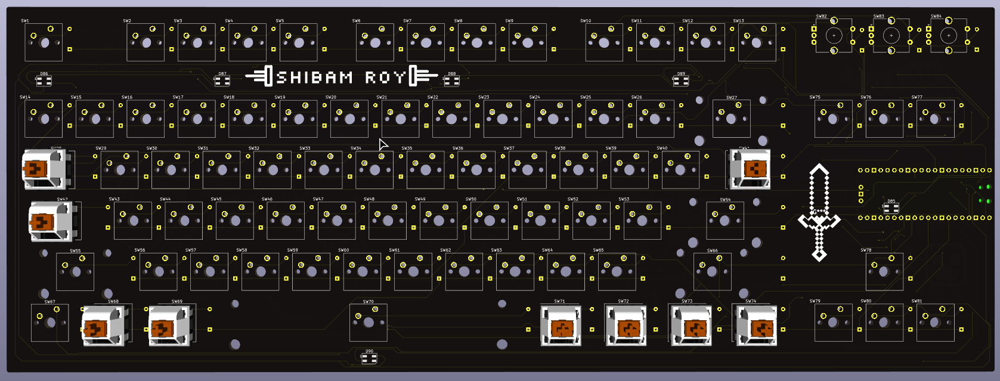
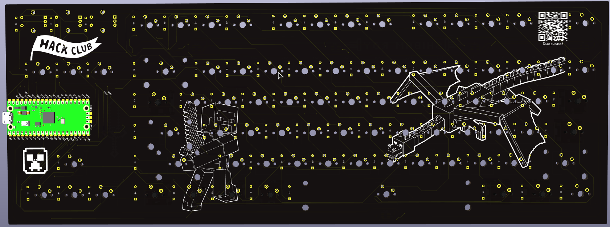
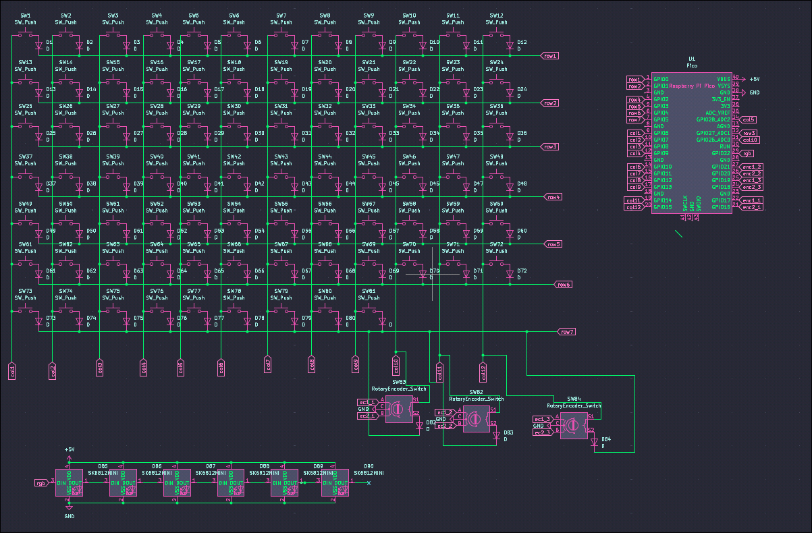
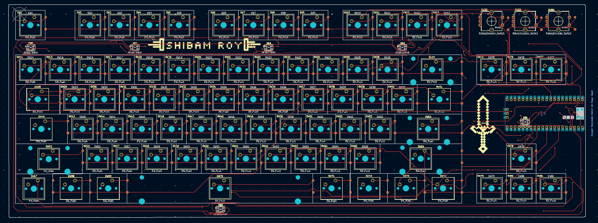
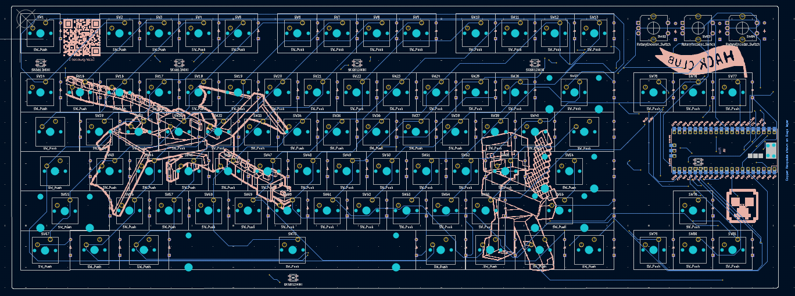
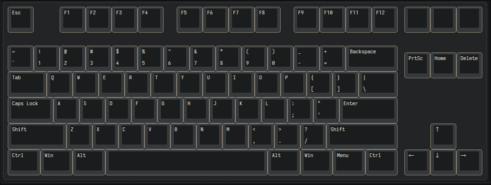
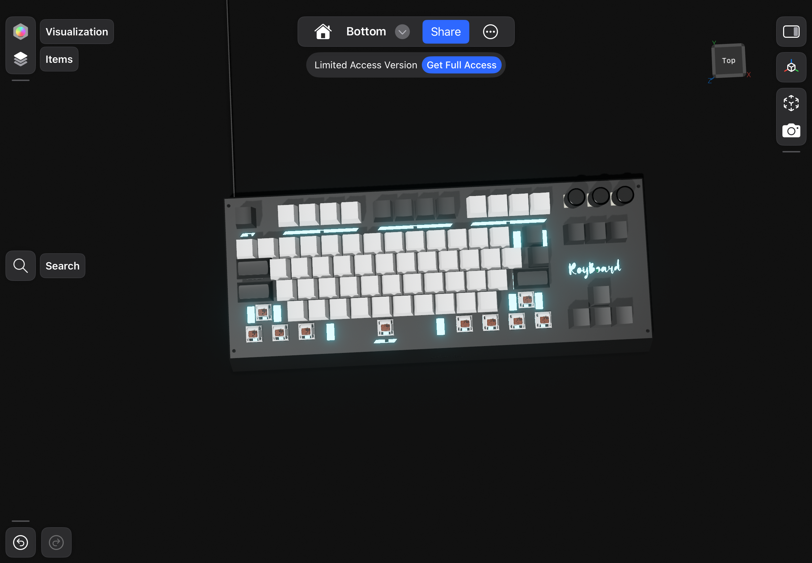
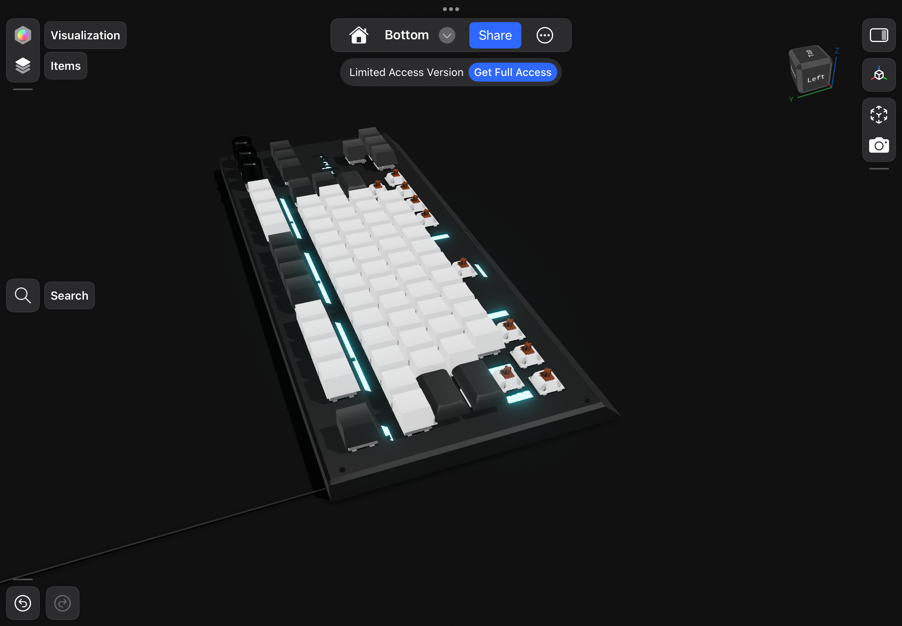

# RoyBoard 

A Custom wired mechanical keyboard that I made by myself! This is a part of [hackclub's](https://hackclub.com/) [hackpad](https://hackpad.hackclub.com/) event, where teenagers like me make their own macropads and keyboards.

## Features 😎

- Includes RGB lights (not per key RGB)
- Has 1 rotary encoder, but has multiple functions
- Consists of 81 keys in total, a 75% keyboard
- Controllable RGB light brightness

## Screenshots 📷

## 3D view

## What tools did I use? 🪛

- [kiCad](https://www.kicad.org/) : For PCB designing
- [shapr3d](https://www.shapr3d.com/) : For Case designing

## Firmware 🖥️

As of now, the firmware is untested, and is written with [kmk](https://github.com/KMKfw/kmk_firmware/blob/main/docs/en/Getting_Started.md).
Does exactly what you would expect a keyboard to do, along with some handy functions(Not yet tested, but I am pretty sure they are gonna be helpful)

## Bill of materials 💰

|Index|Name|Quantity|Price(in USD)|Total Price(in USD)|Link|
|-----|----|--------|-------------|-------------------|----|
|1.| Veekos Gradient Keycaps|x1|15.17|15.17|[here](https://stackskb.com/store/veekos-gradient-keycaps-cherry-profile-135-keys/)|
|2.| Raspberry Pi Pico|x1|3.43|3.43|[here](https://www.silverlineelectronics.in/collections/raspberry-pi-pico/products/raspberry-pi-pico)|
|3.| 1N4148 THT Diodes|x100|0.012|1.16|[here](https://www.amazon.in/dp/B084ZP5BJ3?ref_=cm_sw_r_cp_ud_dp_YPW3WFYTE31QA18570D1&_encoding=UTF8&psc=1)
|4.| EC11 Rotary Encoders |x4|1.04|4.16|[here](https://www.amazon.in/dp/B0888RVZSN?ref_=cm_sw_r_cp_ud_dp_ECM6496E6Q914JPQP2XQ&_encoding=UTF8&psc=1)|
|5.| Gateron EF grayish |x90|20.51|20.51|[here](https://neomacro.in/products/gateron-ef-grayish)|
|6.| Durock Smockey Screw-In Stabilizers v2|x1(4+1 set)|18.66|18.66|[here](https://stackskb.com/store/durock-smokey-screw-in-stabilizers-v2/)|
|7.| PCB |x5|58.11|58.11|[here](https://jlcpcb.com)|
|8.| M3x10mm screws|x4| - | - | [here](-)|
|9.| M3 spacers |x4| - | - | [here](-)|
|10.| M3 nuts |x4| - | - | [here](-)|
|Total|126.2|

> The ones having value "-" are yet to be decided and will soon be updated, till then, just for an estimate of the total price I added $5 extra.

## To-Do 🛠️
- [ ] Build it irl
- [ ] Do testing
 
## Known bugs 🐞
- not yet tested, so no idea:/ , lmk if you find any!

## Contributing 🤝

Everyone is welcome to contribute to the code!

You can also raise an issue, or suggest any features that you think would be great :)

> ✨ Please star this repository if you liked this project 😁
