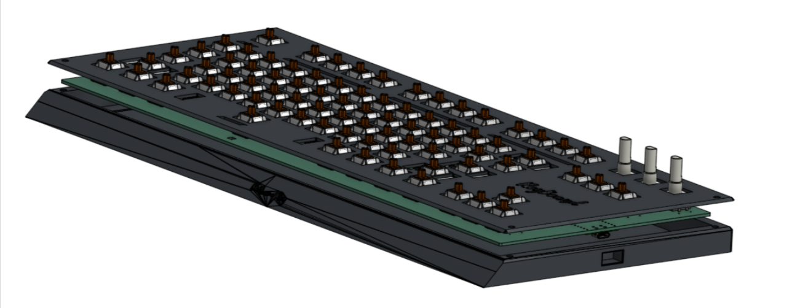
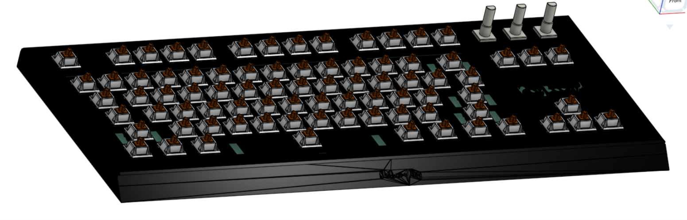
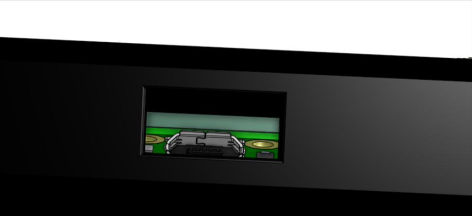
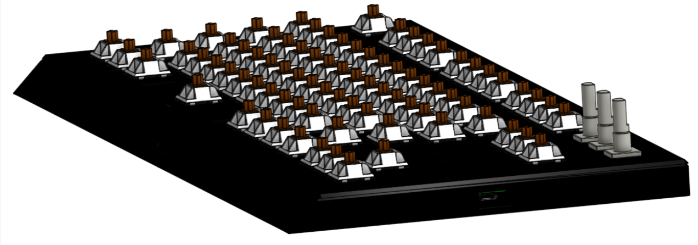
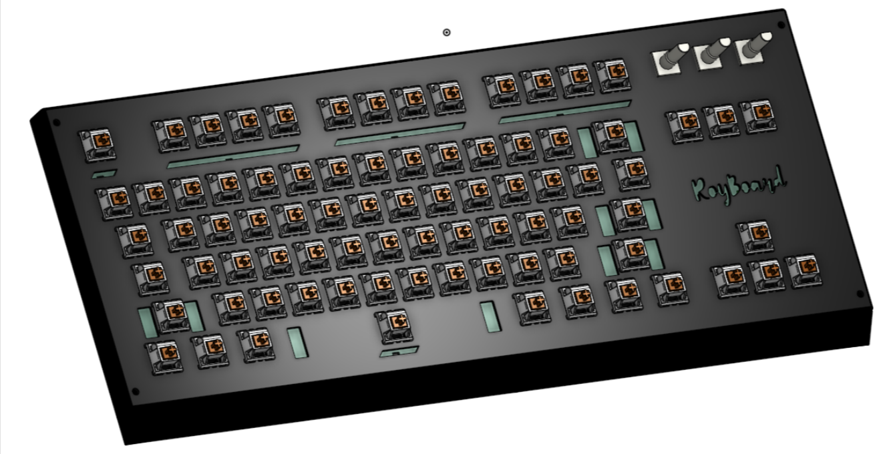

# RoyBoard 

Its a mechanical keyboard that I made from scratch! Its basically a 75% keyboard with 81 keys in total, with 3 additional rotary encoders for different tasks such as volume control, brightness control and scrolling, of course these functionalities are subject to change(I might change them depending on my mood, I would probably add some modes-like-thingy to the firmware). It has a few neopixels too! not per key RGB though, because i rarely use backlight and it was pretty daunting to route them up, considering the fact that i just started hardware back then, the ones which I have are meant for aesthetics(notice the cutouts in the plate).  I tried to make the PCB minecraft themed by the use of some silkscreen.

## Features 

- Includes RGB lights (not per key RGB)
- Has 1 rotary encoder, but has multiple functions
- Consists of 81 keys in total, a 75% keyboard

## 3D view

I would be using these keycaps: [these](https://stackskb.com/store/veekos-gradient-keycaps-cherry-profile-135-keys/)

## Screenshots 

## What tools did I use? 

- [kiCad](https://www.kicad.org/) : For PCB designing
- [shapr3d](https://www.shapr3d.com/) & [OnShape](https://onshape.com): For Case designing
- [keyboard-layout-editor](keyboard-layout-editor.com): For layout designing

## Firmware

As of now, the firmware is untested, and is written with [kmk](https://github.com/KMKfw/kmk_firmware/blob/main/docs/en/Getting_Started.md).
Does exactly what you would expect a keyboard to do, along with some handy functions(Not yet tested, but I am pretty sure they are gonna be helpful)

## Bill of materials

|Index|Name|Quantity|Price(in USD)|Total Price(in USD)|Link|
|-----|----|--------|-------------|-------------------|----|
|1.| Veekos Gradient Keycaps|x1|14.76|14.76|[here](https://stackskb.com/store/veekos-gradient-keycaps-cherry-profile-135-keys/)|
|2.| Raspberry Pi Pico|x1|3.34|3.34|[here](https://www.silverlineelectronics.in/collections/raspberry-pi-pico/products/raspberry-pi-pico)|
|3.| 1N4148 THT Diodes|x100|0.011|1.13|[here](https://www.amazon.in/dp/B084ZP5BJ3?ref_=cm_sw_r_cp_ud_dp_YPW3WFYTE31QA18570D1&_encoding=UTF8&psc=1)
|4.| EC11 Rotary Encoders |x4|3.91|3.91+0.57|[here](https://www.amazon.in/dp/B0888RVZSN?ref_=cm_sw_r_cp_ud_dp_ECM6496E6Q914JPQP2XQ&_encoding=UTF8&psc=1)|
|5.| Gateron weightlessness |x90|0.44|39.91|[here](https://neomacro.in/products/gateron-ef-grayish)|
|6.| Durock Smockey Screw-In Stabilizers v2|x1(4+1 set)|18.13|18.13|[here](https://stackskb.com/store/durock-smokey-screw-in-stabilizers-v2/)|
|7.| PCB |x5|58.11|58.11|[here](https://jlcpcb.com)|
|8.| M3x10mm screws|x4| 0.02 | 0.09 | [here](https://onlyscrews.in/products/phillips-pan-head-m3-x-10mm-pack-of-20?srsltid=AfmBOoqFP2YF-uH3UTtxzyJ8QE0t_tUQ-Qql6p79mTNIDJj5MmGqhR-m)|
|9.| M3 spacers |x4| - | - | [here](-)|
|10.| M3 nuts |x4| - | - | [here](-)|
|Total||||140.15|

> The ones having value "-" are probably things that i would get locally. 8. M3x10mm screws is also something that i might get locally,  but only added the link for reference.

> [!NOTE]
> This DOES NOT include the price for the knobs, and other 3d printed parts of the case. I want to print them through print-legion.

## To-Do 
- [ ] Build it irl
- [ ] Do testing
 
## Known bugs
- not yet tested, so no idea:/ , lmk if you find any!

## Contributing

Everyone is welcome to contribute to the code!
You can also raise an issue, or suggest any features that you think would be great :)

> ✨ Please star this repository if you liked this project 😁
