# RoyBoard 

## Description

Its a mechanical keyboard that I made from scratch! Its basically a 75% tenkeyless keyboard with 81 keys in total, with 3 additional rotary encoders for different tasks such as volume control, brightness control and scrolling, of course these functionalities are subject to change. It has a few neopixels too! not per key RGB though, because i rarely use backlight and it was pretty daunting to route them up, considering the fact that i just started hardware back then, the ones which I have are meant for aesthetics. Currently, I have dropped the plan to solder them because I mirrored the pinouts and it will be a terrible mess to solder them, I guess I am still satisfied with how it turned out though. 

## Features 

- ~Includes RGB lights (not per key RGB)~ (Not soldered)
- Has 3 rotary encoders for different functions
    - Media playback
    - Brightness
    - Volume
    - Scrolling
    - DWM tag switching(Any other wm works)
- 2 Layer keyboard (as of now, may add more in future if needed)
- Consists of 81 keys in total + 3 clickable rotary encoders, a 75%-ish Tenkeyless keyboard
- 5 degree tilt stand for a comfortable typing experience

## Real Life Pics

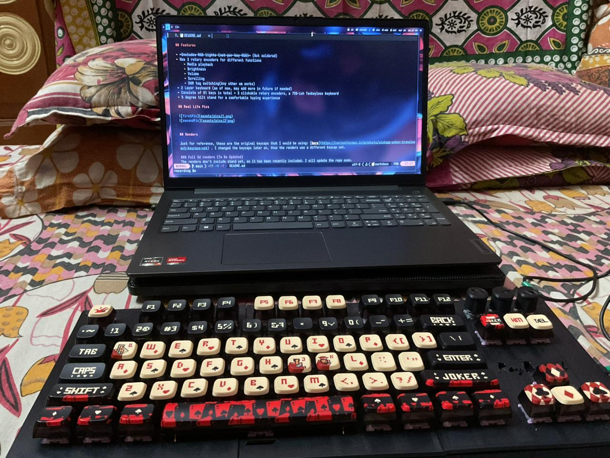

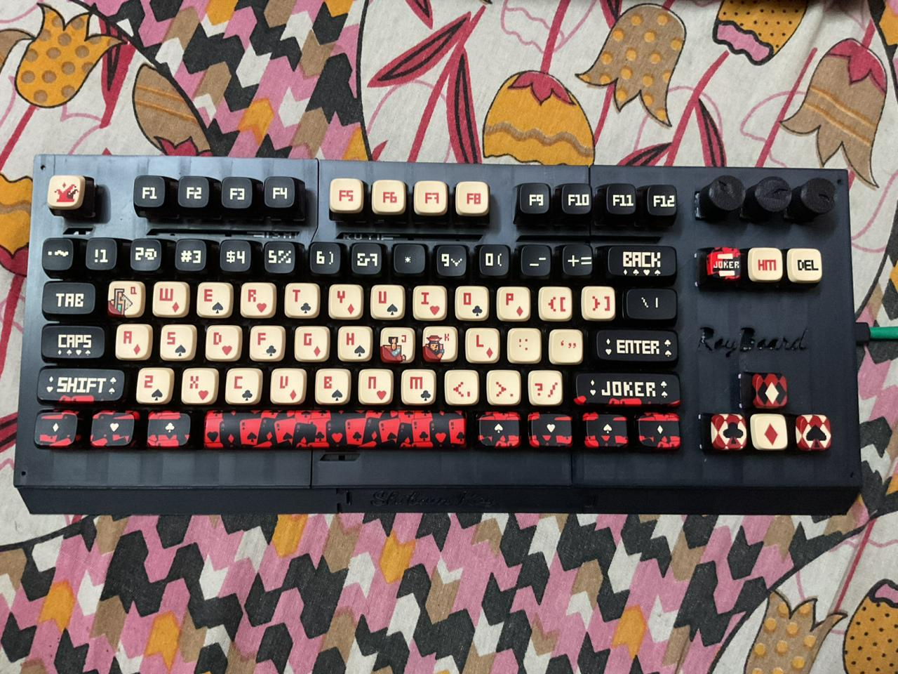

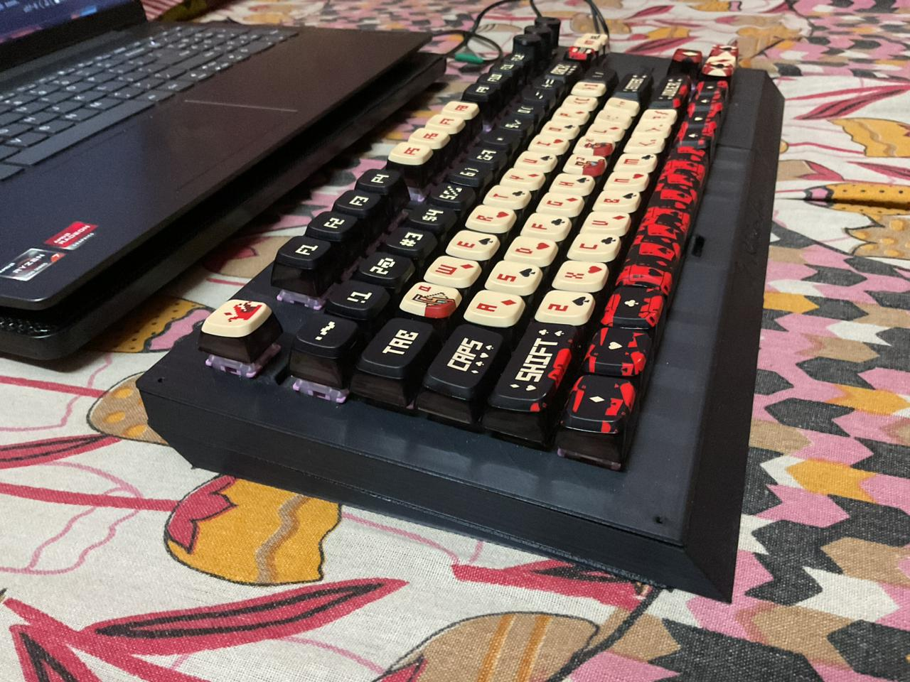

## Renders

Just for reference, these are the original keycaps that I would be using: [here](https://curiositycaps.in/products/vintage-poker-translucent-keycaps-set) . I changed the keycaps later on, thus the renders use a different keycap set.

### Full 3d renders (To Be Updated)
The renders don't include stand yet, as it has been recently included. I will update the repo soon.

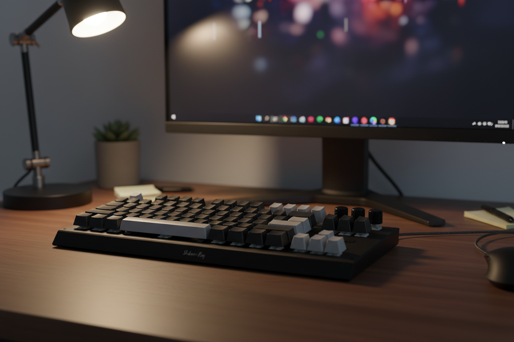

### Bottom case

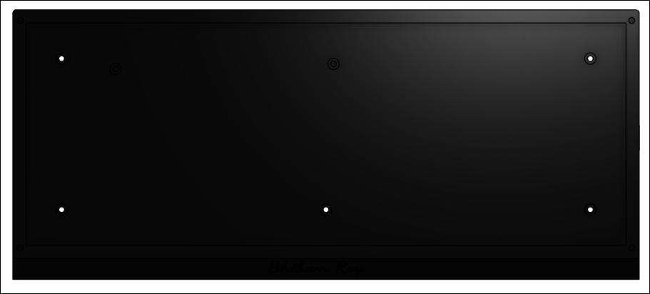
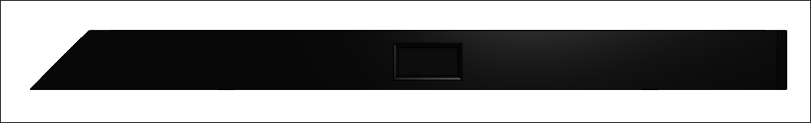
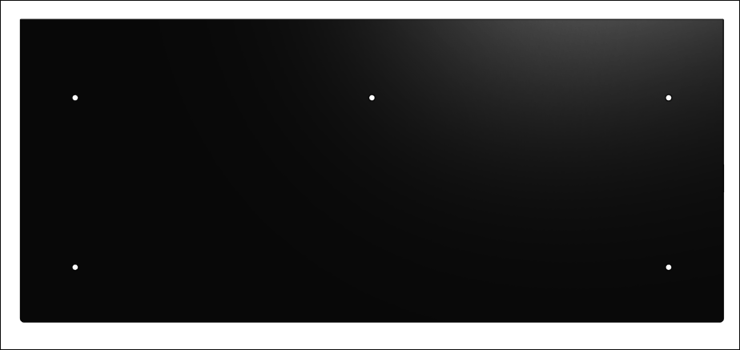

### Top plate

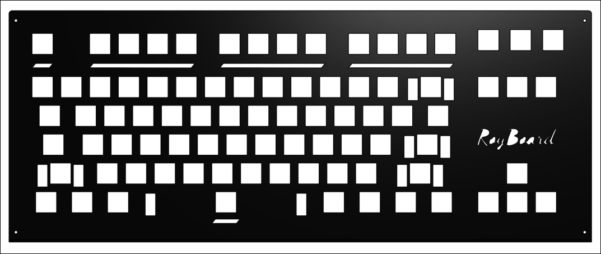

### Stand

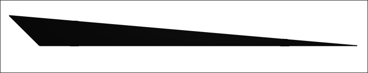
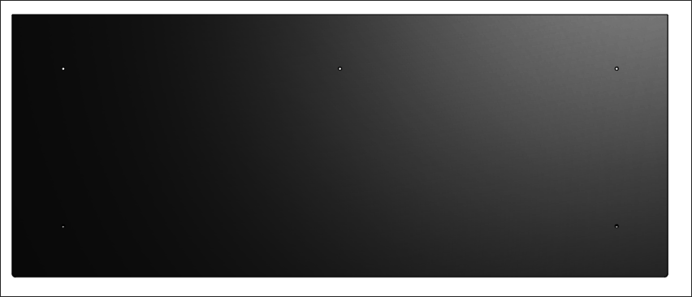
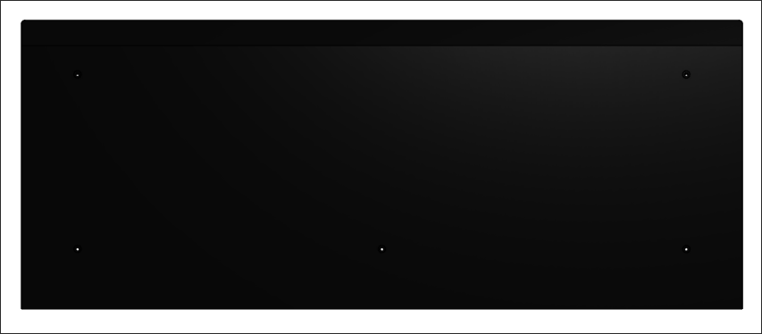

### PCB 3D (Front)

### PCB 3D (Back)

### Schematic

### Layout

### PCB

### PCB Back

### PCB Front

## What tools did I use? 

- [kiCad](https://www.kicad.org/) : For PCB designing
- [shapr3d](https://www.shapr3d.com/) (Mostly) & [OnShape](https://onshape.com): For Case designing
- [keyboard-layout-editor](keyboard-layout-editor.com): For layout designing

## Firmware
Written in QMK, I have shifted the firmware to another repository, so please check that out [here](https://github.com/ShibamRoy9826/RoyBoard-firmware)

## 3D models

You can check the 3d models out in this [public document of OnShape](https://cad.onshape.com/documents/ddc280e53ddd9ad94dbb1da3/w/e89386a56beb1bd36360f18a/e/ed9d1e719b4e163eef3ebe0b?renderMode=0&uiState=6905da6719ceb1e5cc223bec)

## Dimensions

The entire keyboard is **385.65mm** x **166mm** (153 without the branding part) x **13mm**(+13.527mm with stand)

## Bill of materials

| Item name                             |   Net Price(USD) |   Net Price(INR) |   Expected Net Price (INR) |   Diff (INR) |
|:--------------------------------------|-----------------:|-----------------:|---------------------------:|-------------:|
| Vintage Poker Translucent Keycaps Set |            18.2  |          1599    |                    1615.98 |       -16.98 |
| Raspberry PI PICO                     |             5.06 |           449    |                     449.28 |        -0.28 |
| 1N4148 THT Diodes                     |             2.13 |           189    |                     189.12 |        -0.12 |
| EC11 Rotary Encoders                  |             4.48 |           406    |                     397.78 |         8.22 |
| Gateron Weightlessness Switches       |            39.53 |          3510    |                    3509.87 |         0.13 |
| Durock Smokey Screw-In Stabilizers v2 |            18.13 |          1595    |                    1609.76 |       -14.76 |
| PCB                                   |            66    |          5860    |                    5860.14 |        -0.14 |
| SK6812 MINI-E LEDs                    |             7.62 |           669.59 |                     676.58 |        -6.99 |
| M2 x 6 mm Heat inserts                |             1.29 |           114.6  |                     114.54 |         0.06 |
| M2 x 6 mm screws                      |           nan    |           nan    |                     nan    |       nan    |
| 3D Prints                             |           nan    |           nan    |                     nan    |       nan    |

**Total:** $162.44 (14,423 INR)

## To-Do 
- [x] ~Build it irl~
- [x] ~Do testing~
- [x] ~Upload new pics here~

## Contributing

Everyone is welcome to contribute to the code!
You can also raise an issue, or suggest any features that you think would be great :)

## License
Licensed under the MIT License. See [LICENSE](LICENSE) for more information.

> ✨ Please star this repository if you liked this project 😁
