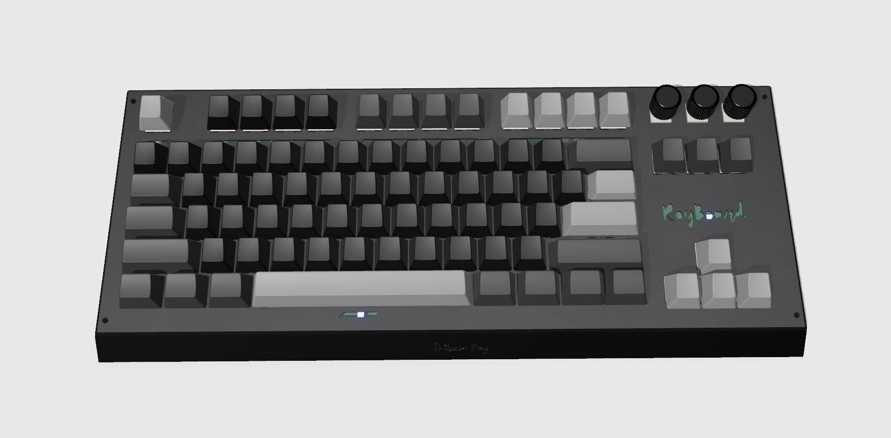
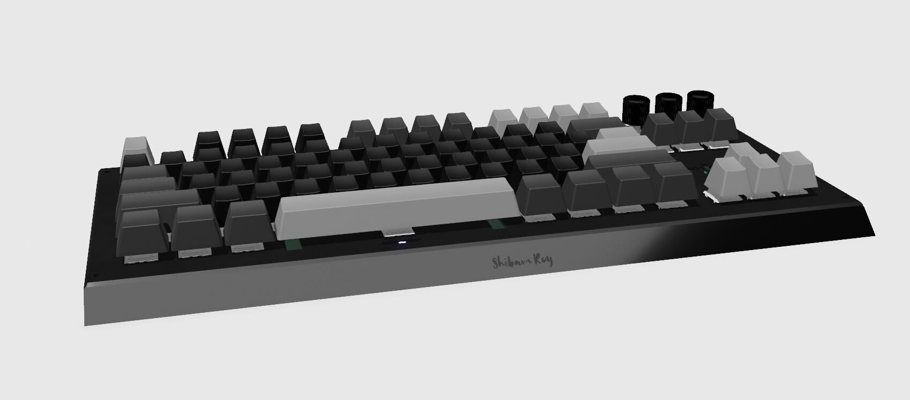
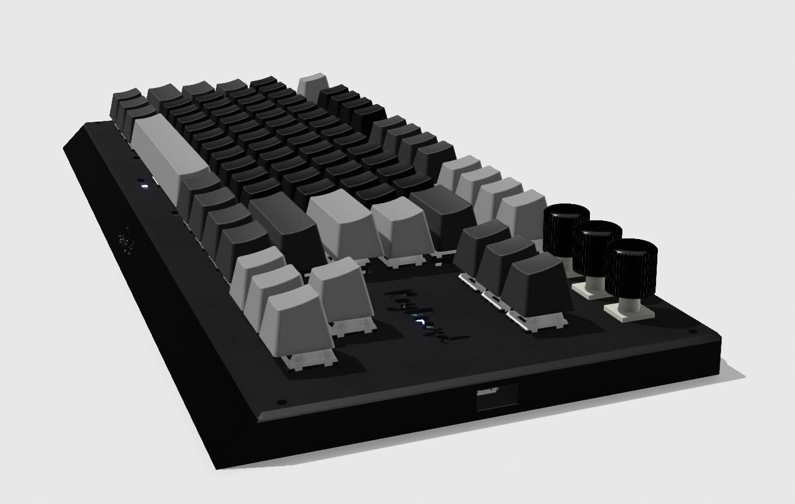
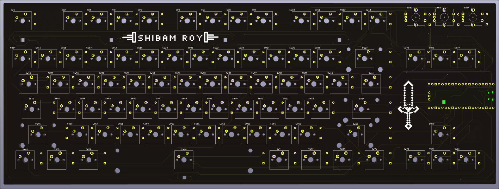
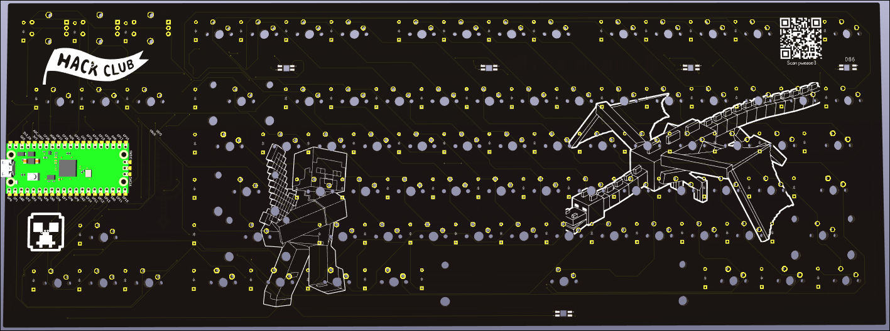
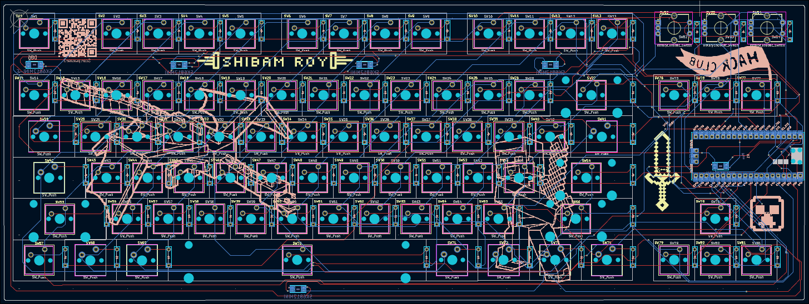
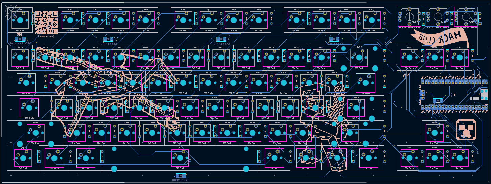
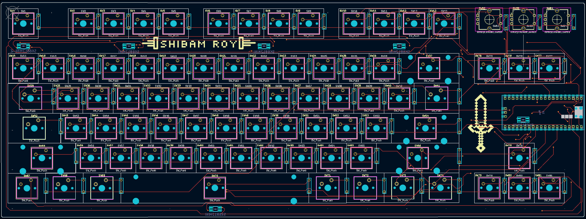

# RoyBoard 

## Description
Its a mechanical keyboard that I made from scratch! Its basically a 75% keyboard with 81 keys in total, with 3 additional rotary encoders for different tasks such as volume control, brightness control and scrolling, of course these functionalities are subject to change(I might change them depending on my mood, I would probably add some modes-like-thingy to the firmware). It has a few neopixels too! not per key RGB though, because i rarely use backlight and it was pretty daunting to route them up, considering the fact that i just started hardware back then, the ones which I have are meant for aesthetics(notice the cutouts in the plate).  I tried to make the PCB minecraft themed by the use of some silkscreen.

## Features 

- Includes RGB lights (not per key RGB)
- Has 3 rotary encoders for different functions
- A unique look that I never saw a keyboard have before
- Consists of 81 keys in total, a 75%-ish keyboard

## Renders
Just for reference, these are the original keycaps that I would be using: [here](https://stackskb.com/store/veekos-gradient-keycaps-cherry-profile-135-keys/)

### Full 3d renders

### PCB 3D (Front)

### PCB 3D (Front)

### Schematic

### Layout

### PCB

### PCB Back

### PCB Front

## What tools did I use? 

- [kiCad](https://www.kicad.org/) : For PCB designing
- [shapr3d](https://www.shapr3d.com/) (Mostly) & [OnShape](https://onshape.com): For Case designing
- [keyboard-layout-editor](keyboard-layout-editor.com): For layout designing

## Firmware
As of now, the firmware is untested, and is written with [kmk](https://github.com/KMKfw/kmk_firmware/blob/main/docs/en/Getting_Started.md).
Does exactly what you would expect a keyboard to do, along with some handy functions(Not yet tested, but I am pretty sure they are gonna be helpful)

## Bill of materials

## Project Bill of Materials

| Index | Item | Qty | Unit Price (USD) | Total (USD) | Total (INR) | Link |
|---|------|-----|------------------|--------------|--------------|------|
| 1 | **Vintage Poker Translucent Keycaps Set** | 1 | 18.20 | 18.20 | ₹1,599 | [StackSKB](https://stackskb.com/store/veekos-gradient-keycaps-cherry-profile-135-keys/) |
| 2 | **Orpheus Pico** | 1 | — | — | — | From Hack Club HQ |
| 3 | **1N4148 THT Diodes** | 100 | 0.011 | 1.13 + 1.02 | ₹99 + ₹90 | [Amazon](https://www.amazon.in/dp/B084ZP5BJ3?ref_=cm_sw_r_cp_ud_dp_YPW3WFYTE31QA18570D1&_encoding=UTF8&psc=1) |
| 4 | **EC11 Rotary Encoders** | 4 | 3.91 | 3.91 + 0.57 | ₹356 + ₹50 | [Amazon](https://www.amazon.in/dp/B0888RVZSN?ref_=cm_sw_r_cp_ud_dp_ECM6496E6Q914JPQP2XQ&_encoding=UTF8&psc=1) |
| 5 | **Gateron Weightlessness Switches** | 90 | 0.44 | 39.91 | ₹3510 | [NeoMacro](https://neomacro.in/products/gateron-weightlessness-switch) |
| 6 | **Durock Smokey Screw-In Stabilizers v2** | 1 set (4+1) | 18.13 | 18.13 | ₹1595 | [StackSKB](https://stackskb.com/store/durock-smokey-screw-in-stabilizers-v2/) |
| 7 | **PCB** | 5 | 23.2 + 34.91 | 58.11 | ₹3,067.66 + ₹2,038.66 | [JLCPCB](https://jlcpcb.com) |
| 8 | **SK6812 MINI-E LEDs** | 10 | 0.85 + 6.77 | 7.62 | ₹669.59 | [LCSC](https://www.lcsc.com/product-detail/C5149201.html) |

---

**Total:** $148.74 (13,074 INR)

### Fasteners
I would be getting these parts myself locally

| # | Item | Qty | Unit Price (USD) | Total (USD) | Total (INR) | Link |
|---|------|-----|-----------------|-------------|-------------|------|
| 1 | **M3 × 10 mm Screws** | 4 | 0.02 | 0.09 | — | [OnlyScrews](https://onlyscrews.in/products/phillips-pan-head-m3-x-10mm-pack-of-20?srsltid=AfmBOoqFP2YF-uH3UTtxzyJ8QE0t_tUQ-Qql6p79mTNIDJj5MmGqhR-m) |
| 2 | **M3 Spacers** | 4 | — | — | — | — |
| 3 | **M3 Nuts** | 4 | — | — | — | — |

> The values containing "-" are equivalent to not-available, they are very cheap and I would likely get them locally. 

> [!NOTE]
> This BOM DOES NOT include the price for the knobs, and other 3d printed parts of the case. I would like to print them through print-legion

## To-Do 
- [ ] Build it irl
- [ ] Do testing
- [ ] Upload new pics here
 

## Contributing

Everyone is welcome to contribute to the code!
You can also raise an issue, or suggest any features that you think would be great :)

> ✨ Please star this repository if you liked this project 😁
